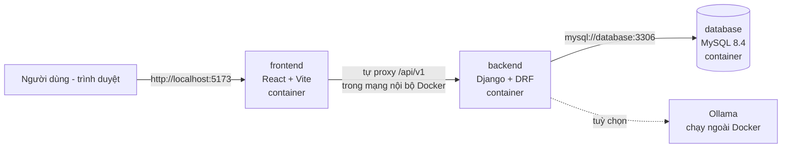
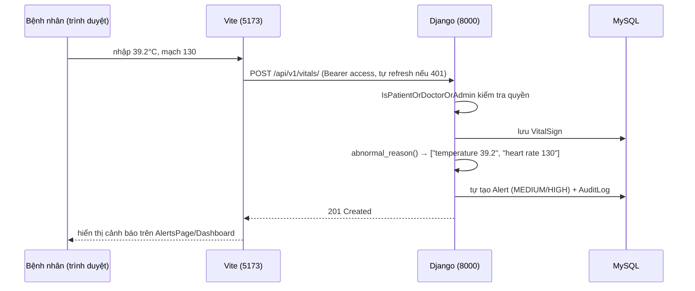

# Hướng dẫn triển khai & đọc hiểu mã nguồn (dành cho người mới)

Tài liệu này hướng dẫn **đưa website "Health Care Monitor" lên một máy tính hoàn toàn mới**
(chưa cài gì cả, kể cả Docker), chỉ dùng Docker Compose — không cần cài Python, Node.js hay
MySQL trực tiếp trên máy. Phần sau của tài liệu **giải thích từng file/folder trong mã nguồn
và tác dụng của nó**.

> Giả định máy đích chạy **Ubuntu/Debian** (phổ biến nhất cho server). Windows/macOS được
> nói ngắn ở mục B4.

---

## MỤC LỤC

- [A. Hệ thống này gồm những gì](#a-hệ-thống-này-gồm-những-gì)
- [B. Chuẩn bị máy tính mới (cài Docker từ số 0)](#b-chuẩn-bị-máy-tính-mới-cài-docker-từ-số-0)
- [C. Triển khai website](#c-triển-khai-website)
- [D. Vận hành hằng ngày](#d-vận-hành-hằng-ngày)
- [E. Lỗi thường gặp](#e-lỗi-thường-gặp)
- [F. Giải thích mã nguồn](#f-giải-thích-mã-nguồn)
- [G. Ghi chú bảo mật trước khi đưa ra internet](#g-ghi-chú-bảo-mật-trước-khi-đưa-ra-internet)

---

## A. Hệ thống này gồm những gì

Website có **3 thành phần (3 container Docker)**, định nghĩa trong `docker-compose.yml`:



| Thành phần | Công nghệ | Cổng | Vai trò |
|---|---|---|---|
| `frontend` | React 18 + TypeScript + Vite + Tailwind | 5173 | Giao diện tiếng Việt cho bệnh nhân / bác sĩ / admin |
| `backend` | Django 5.1 + Django REST Framework + SimpleJWT | 8000 | API REST: đăng nhập, hồ sơ bệnh án, sinh hiệu, cảnh báo, chatbot… |
| `database` | MySQL 8.4 | (nội bộ) | Lưu toàn bộ dữ liệu, giữ lại qua volume `mysql_data` |

**Điểm hay cho người mới:** bạn KHÔNG cần cài Python, Node hay MySQL trên máy. Mọi thứ nằm
trong container. Chỉ cần Docker là đủ.

---

## B. Chuẩn bị máy tính mới (cài Docker từ số 0)

### B1. Kiểm tra máy

Cần máy 64-bit, RAM ≥ 4GB (khuyến nghị 8GB), đĩa trống ≥ 10GB, có internet.

### B2. Cài Docker Engine + Docker Compose (Ubuntu/Debian)

Chạy lần lượt từng lệnh trong terminal (`Ctrl+Alt+T` để mở terminal). Dòng nào có `#` là
giải thích, không cần gõ:

```bash
# 1. Xóa bản Docker cũ (nếu có, máy mới thì bỏ qua cũng không sao)
sudo apt-get remove -y docker docker-engine docker.io containerd runc 2>/dev/null

# 2. Cài tiện ích quản lý repository
sudo apt-get update
sudo apt-get install -y ca-certificates curl gnupg

# 3. Thêm khóa GPG chính thức của Docker
sudo install -m 0755 -d /etc/apt/keyrings
curl -fsSL https://download.docker.com/linux/ubuntu/gpg \
  | sudo gpg --dearmor -o /etc/apt/keyrings/docker.gpg
sudo chmod a+r /etc/apt/keyrings/docker.gpg

# 4. Đưa kho Docker vào danh sách nguồn cài đặt
echo "deb [arch=$(dpkg --print-architecture) signed-by=/etc/apt/keyrings/docker.gpg] \
https://download.docker.com/linux/ubuntu $(. /etc/os-release && echo "$VERSION_CODENAME") stable" \
  | sudo tee /etc/apt/sources.list.d/docker.list > /dev/null

# 5. Cài Docker (bundle gồm docker engine + docker compose plugin + CLI)
sudo apt-get update
sudo apt-get install -y docker-ce docker-ce-cli containerd.io \
  docker-buildx-plugin docker-compose-plugin

# 6. Kiểm tra: bản mới nguyên thì lệnh dưới in ra "Hello from Docker!"
sudo docker run --rm hello-world

# 7. (Khuyến nghị) để chạy docker KHÔNG cần "sudo" mỗi lần
sudo usermod -aG docker $USER
newgrp docker   # hoặc đăng xuất rồi đăng nhập lại

# 8. Kiểm tra compose
docker compose version
```

> **Lưu ý:** từ giờ trong tài liệu, các lệnh `docker ...` giả định bạn đã hoàn thành bước 7.
> Nếu chưa, thêm `sudo` vào trước mọi lệnh `docker`.

### B3. Lấy mã nguồn về máy

Mã nguồn nằm trong thư mục dự án (có file `docker-compose.yml`). Có 3 cách phổ biến:

**Cách 1 — nếu repo đã đẩy lên GitHub/GitLab:**

```bash
sudo apt-get install -y git
git clone <URL-repo-cua-ban> web-theo-doi-suc-khoe-y-te
cd web-theo-doi-suc-khoe-y-te
```

**Cách 2 — copy nguyên thư mục từ máy cũ sang (USB,scp,rsync):**

```bash
# Chạy trên MÁY CŨ, copy sang máy mới (thay IP/tên user):
rsync -av --exclude '.venv' --exclude 'node_modules' --exclude '.git' \
  ./web-theo-doi-suc-khoe-y-te/ user@IP_MAY_MOI:~/web-theo-doi-suc-khoe-y-te/
```

> **Quan trọng:** KHÔNG cần copy `.venv` (môi trường Python của máy cũ — Docker tự build
> môi trường riêng) và KHÔNG copy `node_modules` (Dockerfile sẽ `npm install` hộ bạn).
> Hai file `disease_translations.csv` và `symptom_translations.csv` ở thư mục gốc THÌ BẮT
> BUỘC phải có (dùng để import danh mục bệnh).

**Cách 3 — nén 1 file rồi giải nén:**

```bash
# máy cũ
tar czf healthcare.tar.gz --exclude='.venv' --exclude='node_modules' web-theo-doi-suc-khoe-y-te
# máy mới
tar xzf healthcare.tar.gz && cd web-theo-doi-suc-khoe-y-te
```

### B4. Windows / macOS (tóm tắt)

- **Windows:** bật WSL2 → cài [Docker Desktop](https://www.docker.com/products/docker-desktop/)
  → mở thư mục dự án bằng PowerShell → mọi lệnh `docker compose ...` dưới đây dùng nguyên văn.
- **macOS:** tải Docker Desktop bản Apple Silicon/Intel → mở terminal trong thư mục dự án.
- Mã nguồn dùng đường dẫn tương đối nên chạy được cả 3 hệ điều hành.

### B5. Tạo file cấu hình `.env`

File `.env` **chứa mật khẩu/cấu hình riêng của máy này**, không có trong git — máy mới bắt
buộc phải tự tạo từ mẫu có sẵn:

```bash
cp .env.example .env
nano .env   # sửa các giá trị (xem giải thích bảng dưới)
```

| Biến | Ý nghĩa | Gợi ý |
|---|---|---|
| `DJANGO_SECRET_KEY` | Khóa ký token JWT & mã hóa của Django. **Phải đổi** | Sinh bằng: `openssl rand -hex 32` |
| `DJANGO_DEBUG` | `1` = chế độ dev (Django tự reload, hiện lỗi chi tiết). `0` = gần production (dùng gunicorn) | Giữ `1` khi học/thử nghiệm |
| `DJANGO_ALLOWED_HOSTS` | Danh sách tên miền/IP được phép truy cập API | `localhost,127.0.0.1` (hoặc thêm IP máy) |
| `MYSQL_DATABASE` / `MYSQL_USER` / `MYSQL_PASSWORD` / `MYSQL_ROOT_PASSWORD` | Tên DB, user, mật khẩu MySQL | ⚠️ Xem cảnh báo dưới |
| `CORS_ALLOWED_ORIGINS` / `CSRF_TRUSTED_ORIGINS` | Trình duyệt ở địa chỉ nào được gọi API (chống site giả mạo) | `http://localhost:5173,http://127.0.0.1:5173` |
| `DRF_ANON_RATE` / `DRF_USER_RATE` | Giới hạn số request/phút (chống spam) | Mặc định ổn |
| `OLLAMA_BASE_URL` / `OLLAMA_MODEL` / `OLLAMA_TIMEOUT` | (Tuỳ chọn) kết nối model AI cục bộ cho chatbot | Bỏ trống cũng được — chatbot tự chuyển sang chế độ mock |

> ⚠️ **CẢNH BÁO QUAN TRỌNG:** healthcheck của MySQL trong `docker-compose.yml` đang **hardcode**
> user/password `-uhealthcare -phealthcare`. Nếu bạn đổi `MYSQL_PASSWORD`/`MYSQL_USER` trong
> `.env`, phải sửa luôn dòng `test:` của healthcheck trong `docker-compose.yml`, nếu không
> backend sẽ không bao giờ khởi động (luôn chờ DB "healthy"). Khi tập sự, giữ nguyên
> `healthcare/healthcare` cho đơn giản.

---

## C. Triển khai website

Tất cả chạy từ thư mục gốc dự án (nơi có `docker-compose.yml`):

```bash
# 1. Build image (lần đầu mất vài phút: tải base image, pip install, npm install)
#    và khởi động cả 3 container
docker compose up --build -d
#    -d = chạy nền (detach). Bỏ -d nếu muốn xem log trực tiếp, Ctrl+C để dừng.

# 2. Xem các container đã lên chưa (State phải là "Up", database là "Up (healthy)")
docker compose ps
```

### C1. Khởi tạo lần đầu (chỉ chạy 1 lần đời DB)

```bash
# Tạo các bảng trong MySQL (dịch các file migrations/*.py thành schema thật)
docker compose exec backend python manage.py migrate

# Nạp danh mục 59 bệnh + 377 triệu chứng song ngữ từ 2 file CSV
docker compose exec backend python manage.py import_catalog

# Tạo tài khoản demo + dữ liệu mẫu (chỉ dữ liệu GIẢ)
docker compose exec backend python manage.py seed_demo
```

### C2. Kiểm tra nhanh

```bash
# API phải trả {"status":"ok",...}
curl http://localhost:8000/api/v1/health/

# Chạy bộ 26 test tự động của backend
docker compose exec backend python manage.py test accounts doctors chatbot core
```

Mở trình duyệt:

- **Giao diện:** http://localhost:5173
- **API:** http://localhost:8000/api/v1

Đăng nhập bằng tài khoản seed:

| Tài khoản | Mật khẩu | Vai trò |
|---|---|---|
| `admin` | `admin-secure-pass-2026` | ADMIN (xem mọi thứ + audit log) |
| `dr.nguyen` | `Test1234!` | DOCTOR — Tim mạch |
| `dr.le` | `Test1234!` | DOCTOR — Thần kinh |
| `patient.tran` | `Test1234!` | PATIENT |

Xong! 🎉 truy cập từ máy khác trong cùng mạng thì thay `localhost` bằng IP máy
(xem `ip a`), nhớ thêm IP đó vào `DJANGO_ALLOWED_HOSTS` và `CORS_ALLOWED_ORIGINS` rồi
`docker compose up -d` lại.

### C3. (Tuỳ chọn) bật chatbot AI thật với Ollama

Không có Ollama thì chatbot vẫn chạy bằng **mock reply** (câu trả lời an toàn soạn sẵn).
Để có AI thật trên chính máy đó:

```bash
curl -fsSL https://ollama.com/install.sh | sh
ollama pull qwen2.5:7b
```

Rồi đảm bảo `.env` có `OLLAMA_BASE_URL=http://host.docker.internal:11434` và chạy lại
`docker compose up -d backend`. Nếu backend báo không kết nối được Ollama trên Linux, thêm
vào service `backend` trong `docker-compose.yml`:

```yaml
    extra_hosts:
      - "host.docker.internal:host-gateway"
```

---

## D. Vận hành hằng ngày

```bash
docker compose ps                      # trạng thái 3 container
docker compose logs -f backend         # xem log backend trực tiếp (Ctrl+C để thoát)
docker compose logs --tail=100 database
docker compose restart backend         # khởi động lại 1 service
docker compose stop                    # tắt hết (giữ nguyên dữ liệu)
docker compose start                   # bật lại sau khi stop
docker compose down                    # xoá container (VẪN giữ dữ liệu trong volume)
docker compose down -v                 # xoá CẢ volume — MẤT SẠCH dữ liệu DB!
docker compose up --build -d           # build lại sau khi sửa code/Dockerfile
docker compose exec backend bash       # mở shell bên trong container backend
docker compose exec database mysql -uhealthcare -phealthcare healthcare   # vào MySQL
```

**Sửa code thì sao?** Vì `docker-compose.yml` mount mã nguồn vào container
(`./backend:/app`, `./frontend:/app`):

- Sửa `.py` khi `DJANGO_DEBUG=1` → Django **tự reload**, không cần làm gì.
- Sửa `.tsx/.ts/.css` → Vite **tự hot-reload**, chỉ cần F5 trình duyệt.
- Sửa `requirements.txt` hoặc `package.json` → phải `docker compose up --build -d`.

**Backup dữ liệu** (nên làm định kỳ):

```bash
docker compose exec database mysqldump -uhealthcare -phealthcare healthcare > backup_$(date +%F).sql
# Khôi phục:
docker compose exec -T database mysql -uhealthcare -phealthcare healthcare < backup_2026-09-03.sql
```

---

## E. Lỗi thường gặp

| Hiện tượng | Nguyên nhân & cách xử lý |
|---|---|
| `port is already allocated` / `address already in use` | Cổng 5173/8000 có app khác chiếm. Đổi cổng trong `docker-compose.yml` (vd `"8080:8000"`) hoặc tắt app đó (`sudo ss -ltnp \| grep 8000`) |
| `permission denied ... docker.sock` | Chưa chạy `sudo usermod -aG docker $USER` + đăng xuất/đăng nhập lại (hoặc tạm dùng `sudo docker`) |
| Backend không lên, log `Access denied for user` | Mật khẩu trong `.env` khác với DB đã tạo lần trước. Đổi lại cho khớp, hoặc `docker compose down -v` làm lại từ đầu (mất dữ liệu) |
| Backend chờ mãi `dependency failed to start: container ... is unhealthy` | Hay gặp khi đổi `MYSQL_PASSWORD` mà quên sửa healthcheck (xem cảnh báo mục B5) → sửa healthcheck rồi `docker compose down -v && docker compose up --build -d` |
| Trang trắng / lỗi CORS trên trình duyệt | `CORS_ALLOWED_ORIGINS` chưa khớp địa chỉ đang truy cập (vd truy cập bằng IP nhưng chỉ khai `localhost`) |
| `Could not find a version ... mysqlclient` khi build | Cache build cũ: `docker compose build --no-cache backend` |
| `ModuleNotFoundError` / thiếu thư viện sau khi pull code mới | Quên build lại: `docker compose up --build -d` |
| `import_catalog` không tìm thấy file | Hai file CSV phải nằm ở **thư mục gốc dự án** (compose mount chúng vào `/data/catalog/` trong container) |
| Migrate báo bảng đã tồn tại khi chạy lại | Bình thường — migrate chỉ áp dụng phần chưa chạy. Muốn DB sạch hoàn toàn: `docker compose down -v` rồi chạy lại mục C |
| `docker` chạy được trên máy cũ nhưng máy mới không thấy lệnh | Docker Desktop (Win/mac) chưa chạy — mở app lên trước |

Mẹo chung: khi bí, xem log trước → `docker compose logs backend` (hoặc `database`, `frontend`).

---

## F. Giải thích mã nguồn

Bản đồ nhanh — file nào làm gì:

```
web-theo-doi-suc-khoe-y-te/
├── docker-compose.yml          ← "nhạc trưởng": định nghĩa 3 container + cách chúng nối nhau
├── .env.example                ← mẫu cấu hình; copy thành .env trên mỗi máy
├── disease_translations.csv    ← dữ liệu 59 bệnh (Anh→Việt) cho lệnh import_catalog
├── symptom_translations.csv    ← dữ liệu 377 triệu chứng (Anh→Việt)
├── backend/                    ← toàn bộ API (Django)
│   ├── Dockerfile              ← công thức đóng gói Python+thư viện thành image backend
│   ├── manage.py               ← CLI của Django (migrate, test, chạy lệnh tùy biến)
│   ├── config/                 ← cài đặt chung + định tuyến URL
│   ├── accounts/               ← người dùng, đăng ký/đăng nhập, JWT, phân quyền
│   ├── doctors/                ← hồ sơ bác sĩ + quan hệ bác sĩ–bệnh nhân
│   ├── care/                   ← bệnh án, sinh hiệu, cảnh báo, audit log
│   ├── catalog/                ← danh mục bệnh & triệu chứng
│   ├── chatbot/                ← hội thoại triệu chứng + Ollama/mock + cảnh báo đỏ
│   └── core/                   ← endpoint health check
└── frontend/                   ← giao diện web (React SPA)
    ├── Dockerfile              ← công thức đóng gói Node+Vite thành image frontend
    ├── vite.config.ts          ← cấu hình dev server + proxy API
    └── src/
        ├── App.tsx             ← định tuyến + chặn route theo vai trò
        ├── lib/                ← gọi API, quản lý phiên đăng nhập, kiểu dữ liệu
        ├── components/         ← khung trang (sidebar) + các thành phần UI nhỏ
        └── pages/              ← một file = một màn hình
```

### F1. `docker-compose.yml` — file quan trọng nhất để triển khai

Khai báo **3 service** và Docker đọc nó để dựng cả hệ thống:

- **`database`** (image `mysql:8.4`):
  - `environment`: MySQL bản này tự tạo DB + user khi khởi động lần đầu, từ các biến `MYSQL_*` (đọc từ `.env`, có giá trị `:-mặc định`).
  - `volumes: mysql_data:/var/lib/mysql`: dữ liệu DB nằm trong **volume riêng**, nên `docker compose down` (không `-v`) không mất dữ liệu; container có bị xoá tạo lại thì DB vẫn còn.
  - `healthcheck`: mỗi 5s gọi `mysqladmin ping` để hỏi "DB sẵn sàng chưa?".
- **`backend`** (`build: ./backend` = tự xây image từ Dockerfile):
  - `depends_on.database.condition: service_healthy` → backend **chờ DB khỏe hẳn mới bật**, tránh lỗi "connect refused" lúc boot.
  - `ports: "8000:8000"` → mở cổng máy ra ngoài; `MYSQL_HOST: database` trỏ Django sang container DB — **lưu ý**: trong mạng Docker, các container gọi nhau bằng *tên service* (`database`, `backend`), không phải `localhost`.
  - `volumes: ./backend:/app` → mount mã nguồn: sửa file trên máy = sửa ngay trong container (dev "nóng"). Hai file CSV mount `:ro` (read-only) vào `/data/catalog/` cho lệnh import.
  - `command: sh -c "python manage.py migrate && ..."` → mỗi lần bật container: **tự migrate** rồi mới chạy server; `DJANGO_DEBUG=1` dùng `runserver` (tự reload), ngược lại dùng `gunicorn` (server production).
- **`frontend`** (`build: ./frontend`):
  - `volumes: ./frontend:/app` + `- /app/node_modules` → mount mã nguồn nhưng **giấu node_modules trong image**, để `npm install` lúc build không bị ghi đè bởi folder trống từ máy.
  - `VITE_API_PROXY_TARGET=http://backend:8000` → cho Vite dev server biết proxy API đi đâu trong mạng Docker.
- `restart: unless-stopped` (DB) → máy tính khởi động lại thì Docker tự dựng container lên.

### F2. `backend/Dockerfile`

```dockerfile
FROM python:3.12-slim          # nền: Python 3.12 bản tối giản
RUN apt-get install ... mysqlclient-dev build-essential ...
                               # thư viện C cần để biên dịch driver MySQL
COPY requirements.txt .
RUN pip install -r requirements.txt   # cài Django, DRF, SimpleJWT, mysqlclient, gunicorn
COPY . .                       # chép toàn bộ mã nguồn Django vào image
EXPOSE 8000
```

Image này **không có CMD** — lệnh chạy được định nghĩa bởi `command:` trong compose
(deploy muốn đổi cách chạy thì chỉ sửa 1 chỗ).

### F3. `backend/config/` — cài đặt gốc

- **`settings.py`**: mọi thứ đọc từ **biến môi trường** (nên cùng 1 image chạy được ở mọi máy,
  chỉ khác `.env`). Điểm đáng chú ý:
  - `AUTH_USER_MODEL = 'accounts.User'` → Django dùng model User tự viết (có `role`) thay vì mặc định.
  - `DATABASES` → trỏ MySQL qua `MYSQL_HOST` (trong Docker là `database`).
  - `REST_FRAMEWORK`: xác thực mặc định là **JWT** (SimpleJWT), mọi API **yêu cầu đăng nhập** trừ chỗ ghi `AllowAny`; kèm **throttle** giới hạn 30 req/phút cho khách lạ, 300 cho user đã đăng nhập (chống spam).
  - `CORS_ALLOWED_ORIGINS` / `CSRF_TRUSTED_ORIGINS`: cho phép trình duyệt ở `localhost:5173` được gọi API 8000 kèm cookie.
  - Có **chốt chặn an toàn**: nếu `DEBUG=0` mà `SECRET_KEY` vẫn là giá trị mặc định hoặc `ALLOWED_HOSTS` rỗng → Django từ chối chạy (nêu ở đầu file).
- **`urls.py`**: bản đồ URL — mọi thứ mount dưới `/api/v1/`: `health/`, `auth/`, `doctors/`, `connections/`, `records/`, `vitals/`, `alerts/`, `audit-logs/`, `chat/`, `catalog/...`.
- **`asgi.py` / `wsgi.py`**: điểm vào chuẩn của server Python (compose dùng `config.wsgi:application` cho gunicorn).

### F4. `backend/accounts/` — người dùng & đăng nhập

- **`models.py`**: `User` kế thừa `AbstractUser` của Django, thêm 2 thứ: `email` bắt buộc unique và **`role`** với 3 giá trị `PATIENT / DOCTOR / ADMIN` (`RoleChoices`). Đây là nền của mọi phân quyền sau này.
- **`views.py`** — 5 endpoint auth, thiết kế token rất chuẩn bảo mật:
  - `login_view`: kiểm tra mật khẩu → trả **access token** (sống ngắn, ~vài phút) trong JSON, còn **refresh token** (sống dài) nhét vào **cookie HttpOnly** (`set_refresh_token_cookie`, `httponly=True` → JavaScript đọc không được → XSS khó đánh cắp token; `path='/api/v1/auth/'` → cookie chỉ gửi cho các endpoint auth).
  - `refresh_view` (**rotation + blacklist**): mỗi lần làm mới, token cũ bị **đưa vào danh sách đen** (app `token_blacklist` trong settings) và cấp cặp token mới — dùng lại token cũ sẽ thất bại.
  - `logout_view`: blacklist refresh token + xoá cookie.
  - `me_view`: frontend gọi để "phục hồi phiên" khi tải trang.
- **`serializers.py`**: `RegisterSerializer` kiểm tra dữ liệu đăng ký (mật khẩu ≥8 ký tự, email unique…) và **luôn tạo user role PATIENT** — chỉ có seed/admin mới tạo được bác sĩ/admin.
- **`permissions.py`** (file đang mở trong editor) — 4 "hàng rào" tái sử dụng được:
  - `IsAuthenticatedOrReadOnly`: ai cũng xem được, chỉ người đăng nhập mới sửa được.
  - `IsOwnerOrReadOnly`: so object-level — chỉ chủ (`obj.patient`/`obj.doctor`) mới sửa/xóa.
  - `IsAdminUser` / `IsDoctorOrAdmin`: chặn theo `request.user.role`.
- **`management/commands/seed_demo.py`**: lệnh `python manage.py seed_demo` — tạo 4 tài khoản demo + bác sĩ có hồ sơ chuyên khoa + bệnh án/sinh hiệu mẫu, **chỉ để học/thử**, không dùng dữ liệu thật.
- **`migrations/0001_initial.py`**: "lịch sử cấu trúc bảng" — `manage.py migrate` đọc các file này để tạo/alter bảng MySQL. Không bao giờ tự tay sửa file migration đã chạy.
- **`urls.py` / `tests.py`**: nối 5 view trên vào `/api/v1/auth/...`; bộ test cho luồng đăng ký/đăng nhập/role.

### F5. `backend/doctors/` — bác sĩ & quan hệ với bệnh nhân

- **`models.py`**:
  - `DoctorProfile` (1-1 với `User`): specialty (chuyên khoa), bệnh viện, số năm kinh nghiệm, `is_verified`… — danh bạ công khai.
  - `DoctorPatientConnection`: "đơn kết nối" giữa bác sĩ và bệnh nhân với `status` `PENDING → APPROVED/REJECTED` (có sẵn hàm `approve()`/`reject()`). `unique_together` chặn kết nối trùng.
  - **Ý nghĩa**: đây là "chìa khóa" của quy tắc riêng tư — bác sĩ chỉ thấy dữ liệu bệnh nhân đã `APPROVED`.
- **`views.py`**: `DoctorViewSet` (tìm bác sĩ công khai, không lộ email/phone; `POST /doctors/me/` tự tạo profile cho user DOCTOR) và `ConnectionViewSet` (bệnh nhân `POST` yêu cầu; bác sĩ gọi `respond` để duyệt/từ chối; có ghi audit log).
- **`serializers.py`**: chọn field nào được lộ ra ngoài cho từng vai trò.

### F6. `backend/care/` — trái tim nghiệp vụ y tế

- **`models.py`**:
  - `MedicalRecord`: bệnh án (bệnh nhân, bác sĩ ghi, bệnh từ catalog, chẩn đoán, đơn thuốc).
  - `VitalSign`: 1 lần đo sinh hiệu — nhiệt độ, nhịp tim, huyết áp tâm thu/tâm trương, SpO₂. Hai hàm nghiệp vụ quan trọng:
    - `is_abnormal()` / `abnormal_reason()`: đối chiếu **ngưỡng an toàn** (sốt >38.5° hoặc <35°, mạch >120 hoặc <50, tâm thu >180, SpO₂ <90%…) và liệt kê chỉ số vượt ngưỡng.
  - `Alert`: cảnh báo (severity LOW→CRITICAL, status OPEN→ACKNOWLEDGED/RESOLVED).
  - `AuditLog`: **nhật ký kiểm toán bất biến** — ghi "ai, làm gì, trên bản ghi nào, lúc nào, IP nào". Model chỉ có `create`, không có UI sửa/xóa → bằng chứng điều tra khi có sự cố.
- **`views.py`**:
  - `IsPatientOrDoctorOrAdmin`: permission object-level — ADMIN thấy hết; PATIENT chỉ thấy dữ liệu của mình; DOCTOR chỉ thấy bệnh nhân đã kết nối APPROVED.
  - `get_queryset()` của mỗi ViewSet **lọc theo đúng quy tắc đó ngay từ câu hỏi DB** (defense in depth: dù đoán đúng ID cũng không lấy được dữ liệu người khác).
  - `VitalSignViewSet._maybe_create_alert()`: **tự động hoá quan trọng** — mỗi lần có ca đo bất thường, hệ thống tự sinh `Alert` (HIGH nếu ≥2 chỉ số bất thường, ngược lại MEDIUM) + ghi audit. Bác sĩ không phải ngồi canh số liệu.
  - `perform_create` của bệnh án: chặn bệnh nhân tạo hồ sơ cho người khác, chặn bác sĩ tạo cho bệnh nhân chưa kết nối.
  - `PATCH /alerts/{id}/status/`: chỉ DOCTOR/ADMIN được đổi trạng thái cảnh báo.
- **`audit.py`**: hàm `log_audit(...)` dùng chung — dùng `ContentType` (quan hệ "generic" của Django) để trỏ đến bản ghi thuộc model bất kỳ; `_client_ip()` ưu tiên header `X-Forwarded-For` (làm việc đúng sau reverse proxy).
- **`serializers.py`**: chuyển model ↔ JSON, kèm validate số đo.

### F7. `backend/catalog/` — danh mục bệnh & triệu chứng

- **`models.py`**: `CatalogEntry` (abstract: `name_en` unique + `name_vi`) → 2 model `Disease`, `Symptom` thừa hưởng, khỏi lặp code.
- **`management/commands/import_catalog.py`**: lệnh `import_catalog` đọc 2 file CSV từ `/data/catalog/` (volume mount ở compose) và **upsert** (có thì cập nhật, không thì thêm) — chạy lại nhiều lần không tạo bản trùng.
- **`views.py`**: 2 ViewSet **public** (`AllowAny` + chỉ đọc) hỗ trợ `?search=` — frontend dùng cho ô tìm kiếm và chatbot đối chiếu tên bệnh.

### F8. `backend/chatbot/` — trợ lý định hướng triệu chứng

- **`services.py`** — 3 lớp an toàn:
  1. `SYSTEM_PROMPT` (tiếng Việt): **cấm chẩn đoán, cấm kê đơn**, chỉ hướng dẫn mô tả triệu chứng + gợi ý chuyên khoa, luôn kết "không thay thế ý kiến bác sĩ".
  2. `contains_red_flag()`: danh sách regex triệu chứng cấp cứu (đau ngực, khó thở, yếu liệt, méo miệng, ngất, co giật…) — `normalize_vi()` bỏ dấu tiếng Việt trước khi so để bắt được cả tin nhắn không gõ dấu. **Khớp red-flag → trả lời "gọi 115 ngay", KHÔNG hỏi model AI** (chặn cả trường hợp AI trả lời sai triệu chứng cấp cứu).
  3. `Ollama` (nếu cấu hình & chạy được) → trả lời bằng AI; **mọi lỗi/không cấu hình → mock reply an toàn soạn sẵn** — tính năng không bao giờ "chết hẳn".
- **`models.py` / `views.py`**: lưu `Conversation`/`Message` vào DB, API tạo hội thoại + gửi tin nhắn (kèm phát hiện red-flag ở trên).

### F9. `backend/core/`

`views.py` chỉ có hàm `health()` trả JSON `{"status":"ok"}` — để curl/monitor/docker kiểm tra
API sống hay chết mà không cần đăng nhập.

### F10. `frontend/` — giao diện

- **`Dockerfile`**: `node:22-alpine` → `npm install` lúc build → `CMD npm run dev -- --host 0.0.0.0`
  (Vite dev server, `--host 0.0.0.0` để nghe từ ngoài container).
- **`vite.config.ts`**: 
  - `proxy: { '/api': { target: VITE_API_PROXY_TARGET } }` → **mẹo quan trọng**: trình duyệt chỉ gọi `http://localhost:5173/api/v1/...`, Vite âm thầm chuyển tiếp sang `http://backend:8000` trong mạng Docker. Nhờ vậy request đi **cùng origin** → cookie HttpOnly (SameSite=Lax) hoạt động mà không cần bật CORS phức tạp.
- **`src/lib/api.ts`** — "đường ống" gọi API:
  - Access token giữ **trong biến RAM** (`let accessToken`), **không** bỏ `localStorage` (localStorage đọc được bởi mọi script → dễ bị XSS ăn trộm).
  - `api()` bọc `fetch` với `credentials:'include'` (gửi kèm cookie refresh). Gặp **401 → tự gọi `/auth/refresh/` → thử lại 1 lần**; `refreshPromise` dùng để **gộp** nhiều request 401 cùng lúc chỉ làm 1 lần refresh.
- **`src/lib/auth.context.tsx`**: React Context chứa `{user, login, register, logout}`. Khi tải trang gọi `refresh` + `me` để **tự khôi phục phiên** (người dùng F5 không bị mất đăng nhập).
- **`src/App.tsx`**: định tuyến `react-router`:
  - `RequireAuth roles={[...]}` = "cổng" — chưa đăng nhập đá về `/login`; sai vai trò đá về `/app`. Ví dụ `/app/audit` chỉ ADMIN, `/app/records` cho PATIENT+DOCTOR.
  - `RedirectIfAuthed`: đã đăng nhập thì không cho quay lại trang login.
- **`src/components/Layout.tsx`**: khung chung + **sidebar lọc theo role** (bệnh nhân không thấy mục Audit…). **`ui.tsx`**: các nút/badge/form nhỏ tái sử dụng (Tailwind).
- **`src/pages/*`**: mỗi file một màn hình gọi thẳng qua `api()`: `LoginPage`, `RegisterPage`, `DashboardPage` (tổng quan + cảnh báo), `VitalsPage` (nhập/xem sinh hiệu — nhập xong là backend tự cảnh báo nếu bất thường), `RecordsPage`, `AlertsPage` (duyệt/xử lý cảnh báo), `DoctorsPage` (tìm & xem bác sĩ), `ConnectionsPage` (gửi/duyệt kết nối), `AuditPage` (admin), `ChatbotPage`.
- **`src/lib/types.ts`**: khai báo TypeScript khớp với JSON của API — sửa API mà quên sửa type thì `tsc --noEmit` báo lỗi ngay.

### F11. Luồng một thao tác mẫu ("bệnh nhân nhập sinh hiệu") — ghép mọi thứ lại



---

## G. Ghi chú bảo mật trước khi đưa ra internet

Mô hình trên là **dev/self-host trong mạng nội bộ**. Trước khi mở công khai cần:

1. `DJANGO_DEBUG=0`, `DJANGO_SECRET_KEY` mạnh (compose sẽ tự chuyển sang **gunicorn** khi DEBUG=0).
2. HTTPS bắt buộc (đặt nginx/caddy + certbot trước các container); khi đó bật `SESSION_COOKIE_SECURE`, `CSRF_COOKIE_SECURE`, `SECURE_SSL_REDIRECT`, `secure=True` cho cookie refresh trong `accounts/views.py`.
3. Đổi **toàn bộ** mật khẩu MySQL mặc định (nhớ sửa cả healthcheck như đã cảnh báo).
4. Không dùng `seed_demo` trên môi trường có người thật; không nhập dữ liệu bệnh nhân thật khi chưa có consent, backup mã hoá, chính sách lưu trữ và thẩm định phân quyền (dữ liệu sức khoẻ là dữ liệu nhạy cảm theo quy định Việt Nam).
5. `docker compose down` không xoá volume → dữ liệu vẫn nằm trên đĩa máy chủ; cân nhắc quyền truy cập file và mã hoá volume.

---

*Bản quyền: dự án phục vụ học tập/minh hoạ kỹ thuật, không phải công cụ chẩn đoán y khoa.*
