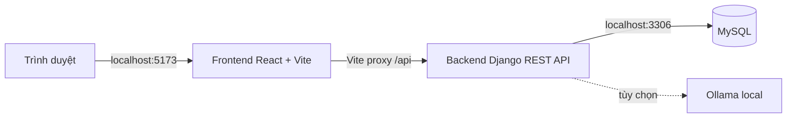

# Health Care Monitor

Nền tảng theo dõi sức khỏe cho bệnh nhân, bác sĩ và quản trị viên.
Project chạy local bằng **MySQL + Django + React/Vite**.

## 1. Tổng quan hệ thống



| Thành phần | Công nghệ | Cổng | Nhiệm vụ |
|---|---|---:|---|
| Frontend | React, TypeScript, Vite, Tailwind CSS | `5173` | Giao diện và thao tác của người dùng |
| Backend | Python, Django, Django REST Framework, SimpleJWT | `8000` | API, xác thực, phân quyền, nghiệp vụ sức khỏe |
| Database | MySQL 8.0+ | `3306` | Lưu tài khoản, hồ sơ, sinh hiệu, cảnh báo, audit và chatbot |
| Ollama | Tùy chọn | `11434` | Chạy LLM local cho chatbot; không có vẫn dùng phản hồi dự phòng |

Luồng request:

1. Trình duyệt mở frontend tại `http://localhost:5173`.
2. Frontend gọi các URL dạng `/api/v1/...`.
3. Vite chuyển request `/api` sang Django tại `http://localhost:8000`.
4. Django kiểm tra JWT, quyền truy cập, đọc/ghi MySQL rồi trả JSON.

## 2. Chức năng chính

- Đăng ký, đăng nhập, đăng xuất, refresh JWT bằng HttpOnly cookie.
- Ba vai trò: `PATIENT`, `DOCTOR`, `ADMIN`.
- Bệnh nhân tìm bác sĩ và tạo kết nối.
- Bác sĩ xem bệnh nhân đã kết nối, tạo hồ sơ bệnh án và sinh hiệu.
- Bệnh nhân tự nhập sinh hiệu, xem hồ sơ và cảnh báo của mình.
- Tự tạo cảnh báo khi nhiệt độ, nhịp tim, huyết áp hoặc SpO2 vượt ngưỡng.
- Catalog song ngữ bệnh và triệu chứng từ CSV.
- Chatbot gửi lịch sử hội thoại và dữ liệu sức khỏe liên quan tới Ollama nếu được cấu hình.
- Audit log bất biến cho các thao tác quan trọng; chỉ admin được xem.

## 3. Yêu cầu máy tính

Hướng dẫn dưới đây dành cho **Windows 10/11 64-bit và PowerShell**.

- RAM tối thiểu 4 GB, khuyến nghị 8 GB.
- Khoảng trống tối thiểu 3 GB cho Python, Node.js, dependencies và MySQL.
- Internet trong lúc cài package.
- Python **3.12 trở lên**.
- MySQL Server **8.0 trở lên**.
- Node.js **20 trở lên** và npm.
- Git, nếu lấy source từ repository.
- VS Code, nếu muốn mở và phát triển project; không bắt buộc để chạy.

## 4. Cài công cụ từ đầu

### 4.1. Cài Git

Tải Git for Windows từ trang chính thức:
`https://git-scm.com/download/win`

Trong trình cài đặt, giữ lựa chọn mặc định. Mở PowerShell mới rồi kiểm tra:

```powershell
git --version
```

Nếu source đã có sẵn trong `H:\web-y-te`, bỏ qua bước clone.

### 4.2. Cài Python

1. Tải Python từ `https://www.python.org/downloads/windows/`.
2. Chọn Python 3.12 hoặc mới hơn, bản **Windows installer (64-bit)**.
3. Ở màn hình đầu tiên, bật **Add python.exe to PATH**.
4. Chọn **Install Now**.
5. Đóng rồi mở lại PowerShell.

Kiểm tra:

```powershell
python --version
python -m pip --version
```

Nếu lệnh `python` mở Microsoft Store, tắt App execution aliases cho Python trong Windows
Settings hoặc dùng đường dẫn Python đã cài.

### 4.3. Cài MySQL Server

1. Tải **MySQL Installer for Windows** từ `https://dev.mysql.com/downloads/installer/`.
2. Chọn bản **Community**.
3. Chọn setup type **Server only** hoặc **Developer Default**.
4. Giữ MySQL Server 8.x và MySQL Shell/Workbench nếu muốn có giao diện quản lý.
5. Chọn authentication mặc định của MySQL 8.
6. Đặt mật khẩu root. Nhớ mật khẩu này để tạo database ở bước sau.
7. Giữ Windows Service chạy tự động, thường có tên `MySQL80`.
8. Hoàn thành installer, mở PowerShell mới.

Kiểm tra client:

```powershell
mysql --version
```

Nếu `mysql` không được nhận diện, mở **MySQL 8.0 Command Line Client** từ Start Menu,
hoặc thêm thư mục tương tự sau vào PATH:

```text
C:\Program Files\MySQL\MySQL Server 8.0\bin
```

Kiểm tra service:

```powershell
Get-Service MySQL80
```

Nếu service chưa chạy:

```powershell
Start-Service MySQL80
```

### 4.4. Cài Node.js

1. Tải Node.js LTS 20 trở lên từ `https://nodejs.org/en/download`.
2. Chạy installer, giữ lựa chọn mặc định và để installer thêm Node vào PATH.
3. Đóng rồi mở lại PowerShell.

Kiểm tra:

```powershell
node --version
npm.cmd --version
```

Project dùng `npm.cmd` trong PowerShell vì một số máy chặn script `npm.ps1` theo
Execution Policy.

## 5. Lấy source và tạo database

### 5.1. Lấy source

Nếu repository ở Git:

```powershell
Set-Location H:\
git clone <URL_REPOSITORY> web-y-te
Set-Location H:\web-y-te
```

Nếu project đã có sẵn, chỉ cần:

```powershell
Set-Location H:\web-y-te
```

Không xóa hoặc đổi tên `disease_translations.csv` và
`symptom_translations.csv` ở thư mục gốc project; đây là dữ liệu đầu vào cho catalog. Nếu repository
đang thiếu một trong hai file, cần khôi phục file CSV tương ứng trước khi chạy
`import_catalog`.

### 5.2. Tạo database và user

Mở **MySQL 8.0 Command Line Client**, nhập mật khẩu root đã đặt lúc cài, rồi chạy:

```sql
CREATE DATABASE healthcare CHARACTER SET utf8mb4 COLLATE utf8mb4_unicode_ci;
CREATE USER 'healthcare'@'localhost' IDENTIFIED BY 'healthcare';
GRANT ALL PRIVILEGES ON healthcare.* TO 'healthcare'@'localhost';
FLUSH PRIVILEGES;
EXIT;
```

Nếu database hoặc user đã tồn tại, dùng phiên bản an toàn hơn:

```sql
CREATE DATABASE IF NOT EXISTS healthcare CHARACTER SET utf8mb4 COLLATE utf8mb4_unicode_ci;
CREATE USER IF NOT EXISTS 'healthcare'@'localhost' IDENTIFIED BY 'healthcare';
GRANT ALL PRIVILEGES ON healthcare.* TO 'healthcare'@'localhost';
FLUSH PRIVILEGES;
```

Thông tin mặc định của backend:

| Biến | Giá trị local |
|---|---|
| `MYSQL_DATABASE` | `healthcare` |
| `MYSQL_USER` | `healthcare` |
| `MYSQL_PASSWORD` | `healthcare` |
| `MYSQL_HOST` | `localhost` |
| `MYSQL_PORT` | `3306` |

## 6. Cài và chạy backend

Mở PowerShell thứ nhất:

```powershell
Set-Location H:\web-y-te\backend
python -m venv ..\.venv
..\.venv\Scripts\python.exe -m pip install --upgrade pip
..\.venv\Scripts\python.exe -m pip install -r requirements.txt
```

Thiết lập biến môi trường cho cửa sổ PowerShell hiện tại:

```powershell
$env:DJANGO_DEBUG="1"
$env:DJANGO_SECRET_KEY="local-dev-key-change-me"
$env:DJANGO_ALLOWED_HOSTS="localhost,127.0.0.1"
$env:MYSQL_DATABASE="healthcare"
$env:MYSQL_USER="healthcare"
$env:MYSQL_PASSWORD="healthcare"
$env:MYSQL_HOST="localhost"
$env:MYSQL_PORT="3306"
$env:CORS_ALLOWED_ORIGINS="http://localhost:5173,http://127.0.0.1:5173"
$env:CSRF_TRUSTED_ORIGINS="http://localhost:5173,http://127.0.0.1:5173"
```

Chạy migration, import catalog và tạo dữ liệu demo:

```powershell
..\.venv\Scripts\python.exe manage.py check
..\.venv\Scripts\python.exe manage.py migrate
..\.venv\Scripts\python.exe manage.py import_catalog
..\.venv\Scripts\python.exe manage.py seed_demo
```

Khởi động API:

```powershell
..\.venv\Scripts\python.exe manage.py runserver 127.0.0.1:8000
```

Giữ cửa sổ này mở. API health check:
`http://localhost:8000/api/v1/health/`

### Biến môi trường backend

`backend/config/settings.py` đọc biến môi trường trực tiếp. File `.env` ở thư mục gốc
không tự động được Django nạp, vì vậy cần set biến trong PowerShell như trên hoặc dùng
cơ chế quản lý environment riêng khi triển khai thật.

| Biến | Bắt buộc | Ý nghĩa |
|---|---|---|
| `DJANGO_DEBUG` | Không | `1` cho local; production phải là `0` |
| `DJANGO_SECRET_KEY` | Có khi `DEBUG=0` | Secret key của Django |
| `DJANGO_ALLOWED_HOSTS` | Có khi `DEBUG=0` | Host được phép truy cập |
| `MYSQL_*` | Không | Cấu hình kết nối MySQL |
| `CORS_ALLOWED_ORIGINS` | Không | Origin frontend được phép gọi API |
| `CSRF_TRUSTED_ORIGINS` | Không | Origin tin cậy cho CSRF |
| `DRF_ANON_RATE` | Không | Rate limit request chưa đăng nhập |
| `DRF_USER_RATE` | Không | Rate limit request đã đăng nhập |

## 7. Cài và chạy frontend

Mở PowerShell thứ hai:

```powershell
Set-Location H:\web-y-te\frontend
npm.cmd install
npm.cmd run dev -- --host 127.0.0.1
```

Mở `http://localhost:5173`.

Frontend dùng `/api/v1` làm API base URL. Vite proxy trong
`frontend/vite.config.ts` chuyển `/api` tới `http://localhost:8000`; không cần sửa code
frontend để chạy local.

`VITE_API_URL` có trong `.env.example` để tham khảo, nhưng API client hiện dùng
`/api/v1` cố định nhằm giữ cookie refresh cùng origin qua Vite proxy.

## 8. Tài khoản demo

Lệnh `seed_demo` tạo dữ liệu giả:

| Tài khoản | Mật khẩu | Vai trò |
|---|---|---|
| `admin` | `admin-secure-pass-2026` | ADMIN |
| `dr.nguyen` | `Test1234!` | DOCTOR |
| `dr.le` | `Test1234!` | DOCTOR |
| `patient.tran` | `Test1234!` | PATIENT |

Đăng ký công khai chỉ tạo tài khoản `PATIENT`. Không dùng tài khoản và dữ liệu demo
trong production.

## 9. Ollama cho chatbot (tùy chọn)

Không cài Ollama, hệ thống vẫn chạy; chatbot trả phản hồi dự phòng khi không kết nối được
LLM.

Muốn chạy LLM local:

1. Cài Ollama từ `https://ollama.com/download/windows`.
2. Khởi động Ollama.
3. Tải model, ví dụ `qwen2.5:7b`:

```powershell
ollama pull qwen2.5:7b
```

4. Đặt biến trong cửa sổ backend trước khi chạy Django:

```powershell
$env:OLLAMA_BASE_URL="http://localhost:11434"
$env:OLLAMA_MODEL="qwen2.5:7b"
$env:OLLAMA_TIMEOUT="15"
```

Backend gửi tin nhắn, lịch sử hội thoại, bệnh án, sinh hiệu và cảnh báo của tài khoản hiện
tại tới Ollama. Chatbot chỉ hỗ trợ định hướng, không thay thế bác sĩ.

## 10. Kiểm tra hệ thống

### Backend

```powershell
Set-Location H:\web-y-te\backend
..\.venv\Scripts\python.exe manage.py check
..\.venv\Scripts\python.exe manage.py test accounts doctors chatbot core
```

### Frontend

```powershell
Set-Location H:\web-y-te\frontend
npm.cmd run build
npx.cmd tsc --noEmit
```

### Health check

```powershell
Invoke-WebRequest http://localhost:8000/api/v1/health/
```

Kết quả hợp lệ có JSON tương tự:

```json
{"status":"ok","service":"healthcare-api"}
```

## 11. Backend: cấu trúc và trách nhiệm

```text
backend/
  manage.py
  requirements.txt
  config/
  core/
  accounts/
  catalog/
  doctors/
  care/
  chatbot/
```

### File dùng chung

| File | Mục đích |
|---|---|
| `backend/manage.py` | Điểm vào cho lệnh Django: migrate, test, runserver, seed |
| `backend/requirements.txt` | Danh sách package Python cần cài |
| `backend/config/settings.py` | Cấu hình Django, MySQL, JWT/DRF, CORS, cookie và security flags |
| `backend/config/urls.py` | Gắn health endpoint, URL của từng app và router catalog |
| `backend/config/asgi.py` | Điểm vào ASGI cho server async/deployment |
| `backend/config/wsgi.py` | Điểm vào WSGI cho Gunicorn hoặc server WSGI |
| `backend/core/views.py` | Endpoint kiểm tra API còn hoạt động |
| `backend/core/tests.py` | Test cho core/health |

### `accounts`: tài khoản và xác thực

| File | Mục đích |
|---|---|
| `accounts/models.py` | Custom `User`, role và cờ bắt buộc đổi mật khẩu |
| `accounts/serializers.py` | Validate/serialize đăng ký, đăng nhập, user và admin user |
| `accounts/views.py` | Register, login, refresh, logout, me, đổi mật khẩu, quản lý user |
| `accounts/urls.py` | Route cho các view xác thực |
| `accounts/permissions.py` | Permission theo role: admin, doctor, patient/doctor |
| `accounts/tests.py` | Test register, login, token, role và quyền admin |
| `accounts/management/commands/seed_demo.py` | Tạo tài khoản, profile, kết nối và dữ liệu demo |
| `accounts/migrations/` | Lịch sử schema của user |

### `catalog`: bệnh và triệu chứng

| File | Mục đích |
|---|---|
| `catalog/models.py` | Model `Disease` và `Symptom` song ngữ |
| `catalog/serializers.py` | JSON serializer cho catalog |
| `catalog/views.py` | API đọc công khai, tìm kiếm theo tên Anh/Việt |
| `catalog/management/commands/import_catalog.py` | Import/update dữ liệu từ hai file CSV |
| `catalog/migrations/` | Lịch sử schema catalog |
| `disease_translations.csv` | Dữ liệu tên bệnh Anh/Việt |
| `symptom_translations.csv` | Dữ liệu tên triệu chứng Anh/Việt |

### `doctors`: bác sĩ và kết nối

| File | Mục đích |
|---|---|
| `doctors/models.py` | `DoctorProfile`, kết nối bác sĩ-bệnh nhân và trạng thái kết nối |
| `doctors/serializers.py` | JSON public/full profile và connection payload |
| `doctors/views.py` | Danh bạ bác sĩ, profile của tôi, tạo/list/hủy connection |
| `doctors/urls.py` | Router cho `/doctors/` và `/connections/` |
| `doctors/tests.py` | Test profile, kết nối và giới hạn truy cập |
| `doctors/migrations/` | Lịch sử schema doctors |

### `care`: dữ liệu chăm sóc sức khỏe

| File | Mục đích |
|---|---|
| `care/models.py` | `MedicalRecord`, `VitalSign`, `Alert`, `AuditLog` và trạng thái liên quan |
| `care/serializers.py` | Validate/serialize bệnh án, sinh hiệu, cảnh báo, audit |
| `care/views.py` | CRUD có kiểm tra quyền, tạo cảnh báo tự động, cập nhật alert và audit API |
| `care/audit.py` | Hàm ghi audit log cho thao tác quan trọng |
| `care/urls.py` | Router cho records, vitals, alerts, audit logs |
| `care/tests.py` | Test object-level permission, sinh hiệu và cảnh báo |
| `care/migrations/` | Lịch sử schema care |

### `chatbot`: hội thoại và LLM

| File | Mục đích |
|---|---|
| `chatbot/models.py` | Conversation và message |
| `chatbot/serializers.py` | JSON conversation/message và validate tin nhắn |
| `chatbot/services.py` | Gọi Ollama qua HTTP, timeout và mock fallback |
| `chatbot/views.py` | Tạo/list/xóa conversation, gửi message, dựng patient context |
| `chatbot/urls.py` | Router cho endpoint chatbot |
| `chatbot/tests.py` | Test routing LLM, fallback và API hội thoại |
| `chatbot/migrations/` | Lịch sử schema chatbot |

### API chính

Tất cả API nằm dưới `/api/v1`:

| Nhóm | Endpoint tiêu biểu | Quyền |
|---|---|---|
| Auth | `/auth/register/`, `/auth/login/`, `/auth/refresh/`, `/auth/me/` | Public/authenticated tùy endpoint |
| Catalog | `/catalog/diseases/`, `/catalog/symptoms/` | Public |
| Doctors | `/doctors/`, `/doctors/me/` | Public hoặc doctor/admin |
| Connections | `/connections/` | Patient/doctor |
| Care | `/records/`, `/vitals/`, `/alerts/` | Patient/doctor theo object permission |
| Admin | `/audit-logs/`, `/auth/admin/users/` | Admin |
| Chatbot | `/chat/conversations/` | Patient/doctor |
| Health | `/health/` | Public |

Bệnh nhân chỉ xem dữ liệu của mình. Bác sĩ chỉ xem dữ liệu của bệnh nhân đã có kết nối
`APPROVED`. Admin quản lý user và xem audit log.

## 12. Frontend: cấu trúc và trách nhiệm

```text
frontend/
  index.html
  package.json
  vite.config.ts
  tsconfig.json
  tsconfig.node.json
  src/
    main.tsx
    App.tsx
    style.css
    components/
    lib/
    pages/
```

| File/thư mục | Mục đích |
|---|---|
| `frontend/index.html` | HTML shell chứa phần tử `#root` |
| `frontend/package.json` | Scripts và package JavaScript |
| `frontend/vite.config.ts` | Cấu hình Vite, React, Tailwind và proxy API |
| `frontend/tsconfig.json` | Cấu hình TypeScript cho source frontend |
| `frontend/tsconfig.node.json` | Cấu hình TypeScript cho file cấu hình Node/Vite |
| `frontend/src/main.tsx` | Mount React app, bật `StrictMode`, nạp CSS |
| `frontend/src/App.tsx` | Router, route guard, mapping page theo role |
| `frontend/src/style.css` | CSS global và design tokens |
| `frontend/src/components/Layout.tsx` | Sidebar, menu theo role, user summary, logout, outlet |
| `frontend/src/components/ui.tsx` | Component UI dùng chung như button, input, card, spinner |
| `frontend/src/lib/api.ts` | Fetch client, JWT trong memory, refresh token và xử lý lỗi |
| `frontend/src/lib/auth.context.tsx` | State phiên đăng nhập, login/register/logout/restore session |
| `frontend/src/lib/types.ts` | TypeScript types khớp response của backend |

### Các page

| File | Mục đích |
|---|---|
| `LoginPage.tsx` | Đăng nhập |
| `RegisterPage.tsx` | Đăng ký bệnh nhân |
| `DashboardPage.tsx` | Tổng quan theo tài khoản |
| `VitalsPage.tsx` | Xem/thêm sinh hiệu |
| `RecordsPage.tsx` | Xem/thêm/cập nhật bệnh án |
| `AlertsPage.tsx` | Xem và cập nhật trạng thái cảnh báo |
| `DoctorsPage.tsx` | Bệnh nhân tìm bác sĩ |
| `ConnectionsPage.tsx` | Bác sĩ xem kết nối được duyệt |
| `ChatbotPage.tsx` | Quản lý cuộc trò chuyện và gửi tin nhắn |
| `AuditPage.tsx` | Admin xem audit log |
| `UsersPage.tsx` | Admin tạo/xóa tài khoản |
| `ChangePasswordPage.tsx` | Đổi mật khẩu bắt buộc |

## 13. Lỗi thường gặp

### `DJANGO_SECRET_KEY must be set`

Bạn chưa set biến môi trường trong đúng cửa sổ PowerShell đang chạy backend. Chạy lại:

```powershell
$env:DJANGO_DEBUG="1"
$env:DJANGO_SECRET_KEY="local-dev-key-change-me"
```

### `Can't connect to MySQL server`

Kiểm tra service và port:

```powershell
Get-Service MySQL80
Test-NetConnection localhost -Port 3306
```

Nếu service dừng, chạy `Start-Service MySQL80`. Kiểm tra lại `MYSQL_USER`,
`MYSQL_PASSWORD`, `MYSQL_DATABASE`, `MYSQL_HOST`, `MYSQL_PORT`.

### `mysql is not recognized`

MySQL chưa có trong PATH. Dùng MySQL Command Line Client từ Start Menu hoặc thêm thư mục
`C:\Program Files\MySQL\MySQL Server 8.0\bin` vào PATH rồi mở PowerShell mới.

### `npm.ps1 cannot be loaded`

Dùng `npm.cmd` thay cho `npm`, ví dụ `npm.cmd install` và `npm.cmd run dev`.

### Frontend báo lỗi gọi API

Đảm bảo cả hai server đang chạy, backend ở `127.0.0.1:8000`, frontend ở
`127.0.0.1:5173`. Vite proxy không hoạt động nếu chỉ mở frontend mà chưa chạy Django.

### `CSV file not found`

Kiểm tra hai file catalog trong thư mục gốc project. Lệnh import dùng hai file này mặc định;
hãy truyền đường dẫn thủ công nếu đặt file ở nơi khác:

```powershell
..\.venv\Scripts\python.exe manage.py import_catalog `
  --diseases "D:\data\disease_translations.csv" `
  --symptoms "D:\data\symptom_translations.csv"
```

## 14. Lưu ý bảo mật và y tế

- Không đưa mật khẩu demo, `DJANGO_SECRET_KEY` local hoặc dữ liệu bệnh nhân thật lên Git.
- Production cần `DJANGO_DEBUG=0`, secret key riêng, HTTPS, cookie secure, backup mã hóa,
  MFA, chính sách retention và rà soát object-level authorization.
- Đây là nền tảng kỹ thuật, không phải công cụ chẩn đoán. Không dùng chatbot hoặc cảnh báo
  tự động để thay thế đánh giá trực tiếp của nhân viên y tế.
